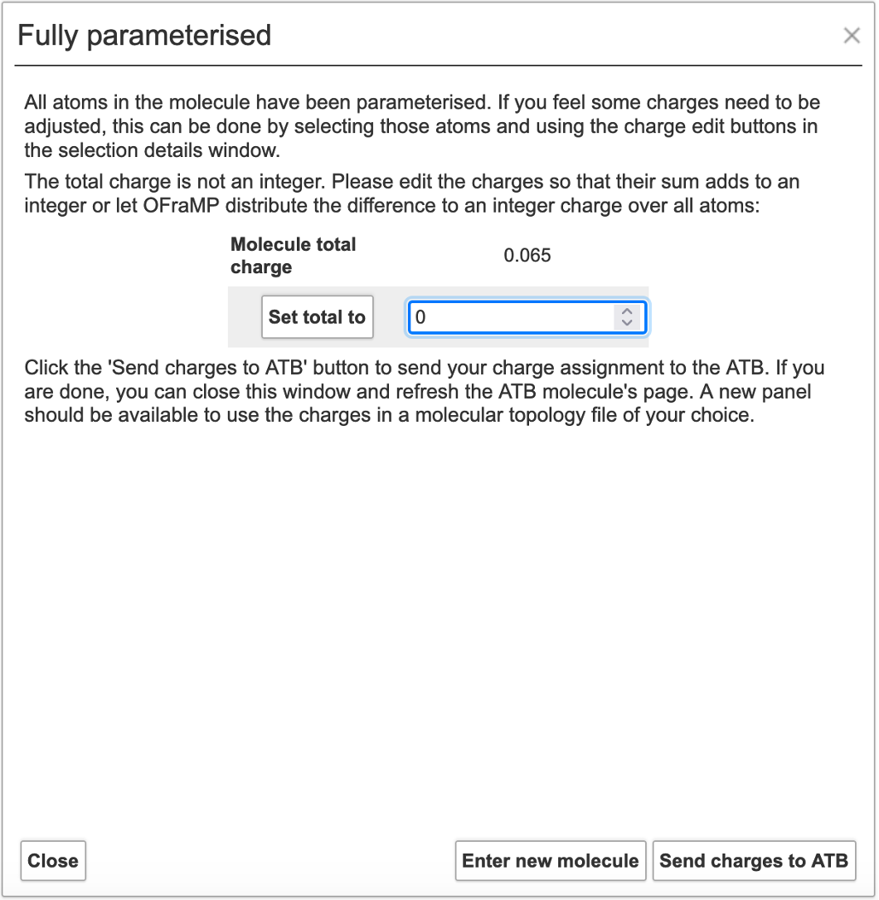
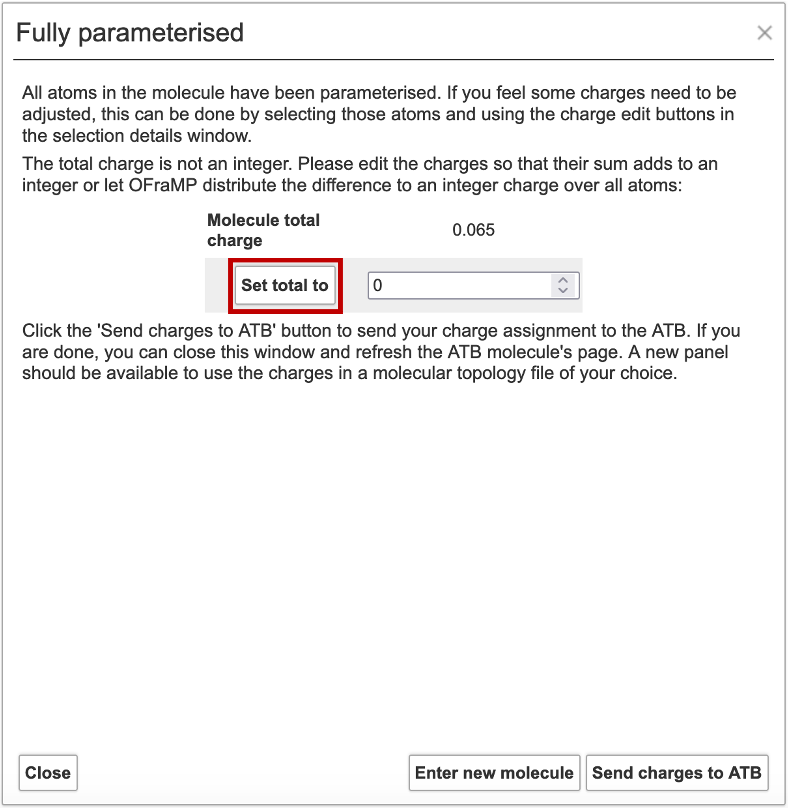
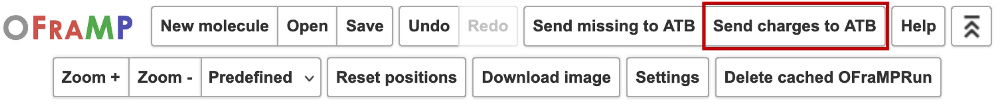

Building the target molecule
===================

Once you have imported your target molecule into OFraMP, you can start building it with fragments from pre-paramtrised molecules from the ATB database. An example target molecule is displayed in the image below.

.. image:: images/Loaded_target_OFraMP_molecule.png
   :width: 600

Selecting fragments
-------------------

To begin selecting fragments click on an atom group.

.. image:: images/select_atom_group.png
   :width: 500

Its information will appear on a window to the left of the target molecule. This information includes the number of atoms in the atom group, the number of atoms in the group that have been parametrised, and any charges that may have been assigned to those atoms. If no charges have yet been assigned, the sections that show this information will be blank.

A list of potential fragments that include the selected atom group will appear on a window to the right of the target molecule. The fragments are in descending order of the likelihood of it being the best match. 

Click on one of the fragments in the list to view its prompts.

You can view the pre-parametrised molecule the fragment is being pulled from by clicking 'Show molecule'.

Click 'Select fragment' to use it for the parametrisation of your target molecule.

.. image:: images/select_fragment.png
   :width: 600

Once you have selecteded a fragment, the atom groups in the target molecule will be coloured a light green.

.. image:: images/light_green_selected_fragment.png
   :width: 500

Continue to select fragments until the target molecule has been fully parametrised.

Charge clashes
--------------

The atom groups of selected atoms may overlap. The charge of the overlapping atom group may differ in each fragment. Atom groups with clashing charges will be coloured yellow in the target molecule. 

If an fragment with a conflicting charge is selected, the window below will load. It will ask you to resolve the clash.

.. image:: images/charge_clash_window.png
   :width: 450

You can resolve the clash by averaging the charges, by using the charge from the newly selected fragment, the current charge, or a custom charge.

Click 'Apply solution'.

.. image:: images/apply_clash_solution.png
   :width: 450

Missing charges
---------------

One or multiple atom groups may not be able to assigned a charge from the available pre-parametrised molecules from the ATB at your chosen shell size. These atom groups will be coloured in red.

.. image:: images/missing_atom_groups.png
   :width: 500

To resolve this, click 'Send missing to ATB' in OFraMP's menu. This will generate a one or more molecule's that will cover the missing paramter space, and send them to the ATB for processing. 

.. image:: images/send_missing_to_ATB.png
   :width: 600

You can also choose to `submit <https://atb-uq.github.io/atb_docs/general/submitting_molecules.html>`_ a molecule in the ATB that covers the missing parameter space yourself. 

The missing charge parameters can also be assigned `manually <https://atb-uq.github.io/atb_docs/OFraMP/Manual_charge_change.html>`_. 

Reducing the shell size to search for the missing atom groups in a larger set of fragments is also an option. 

Completing the target molecule
------------------------------

Once your target molecule is fully parametrised the window below will appear.

.. image:: images/fully_parametrised_window.png
   :width: 450

The total charge of your molecule may not be correct. If this is the case you can do one of two things. 

#. You can average the charge difference between the current charge of the molecule and your desired charge over all the atom groups. 
#. You can manually change the charges of specific atoms.

To average the difference of the charge evenly among all the atom groups first type the appropriate integer charge in the input box.

Then click 'Set total to'. 

The 'Molecule total charge' should now be equal to your selected integer.

If you are happy with the parametrisation of your target molecule, click 'Send charges to ATB' on the window.

.. image:: images/send_charges_to_ATB_window.png
   :width: 450

To manually change the charges of specifc atoms you must first close the window,

.. image:: images/close_fully_parametrised_window.png
   :width: 450

Please view this `tutorial <https://atb-uq.github.io/atb_docs/OFraMP/Manual_charge_change.html>`_ on how to manually change the charge of individual atoms.

Once you are happy with the parametrisation of your target molecule, click 'Send charges to ATB' in OFraMP's menu. 

