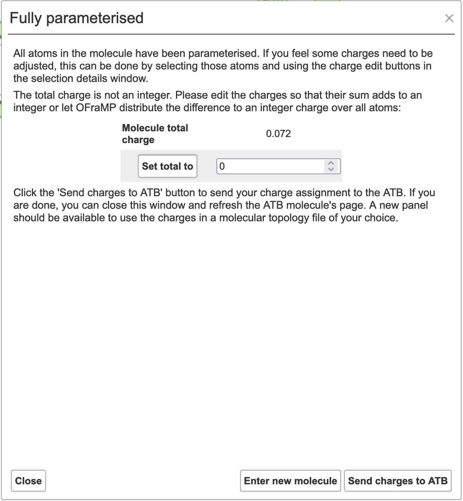
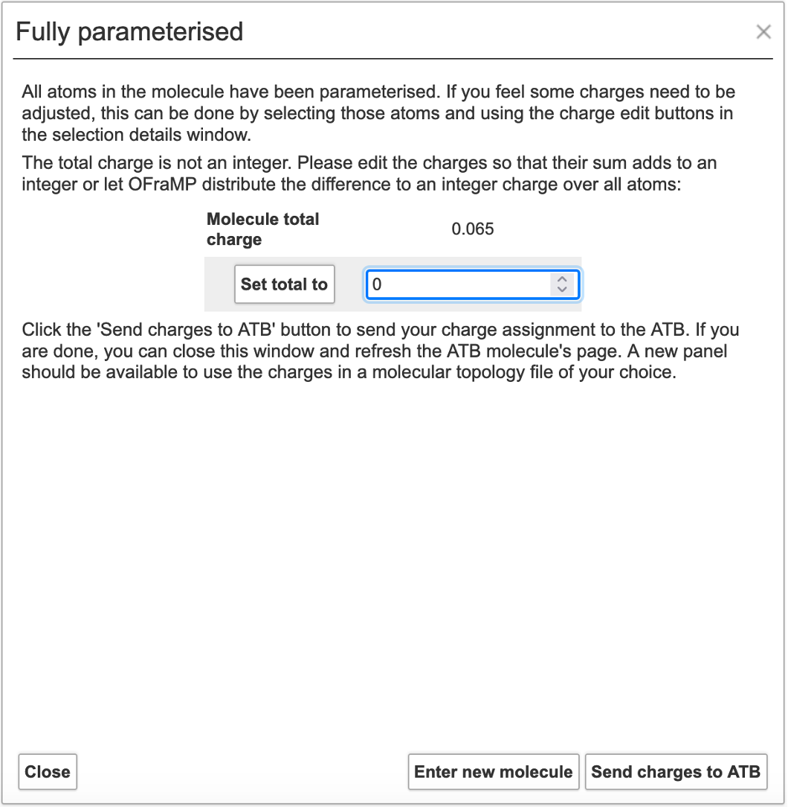
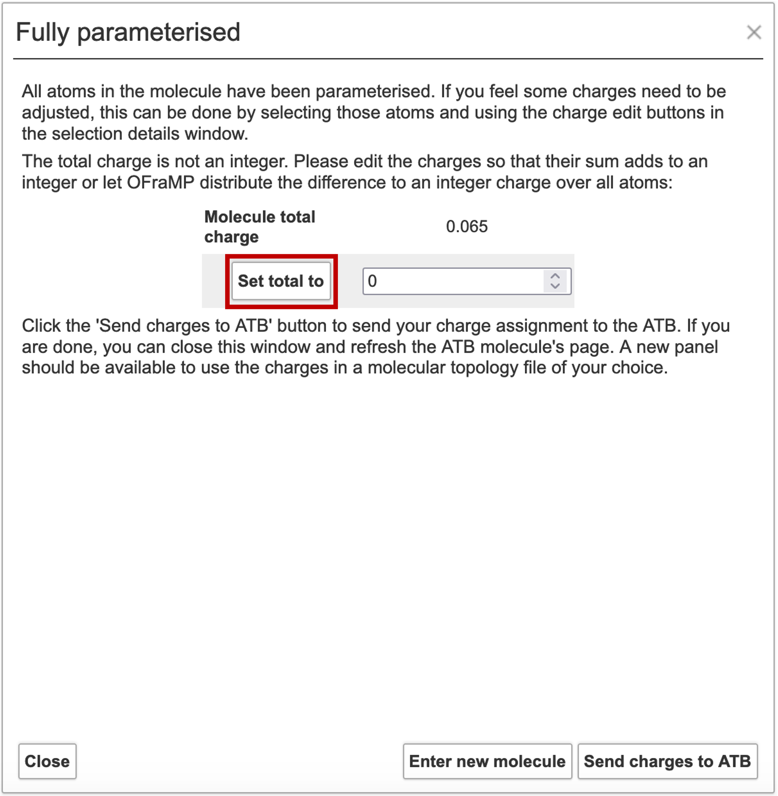
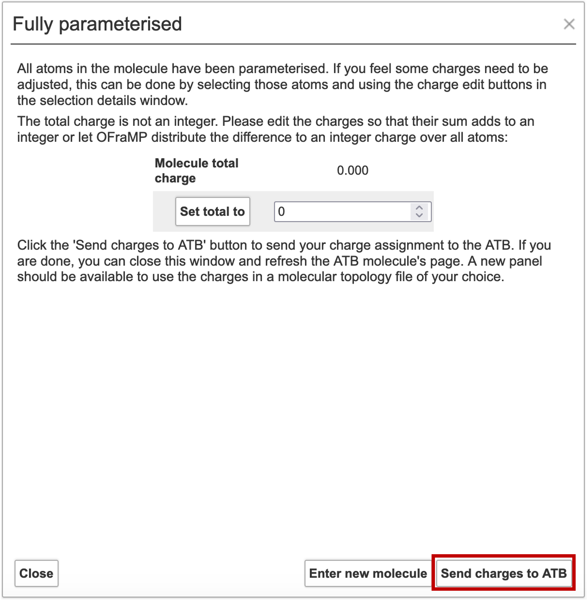
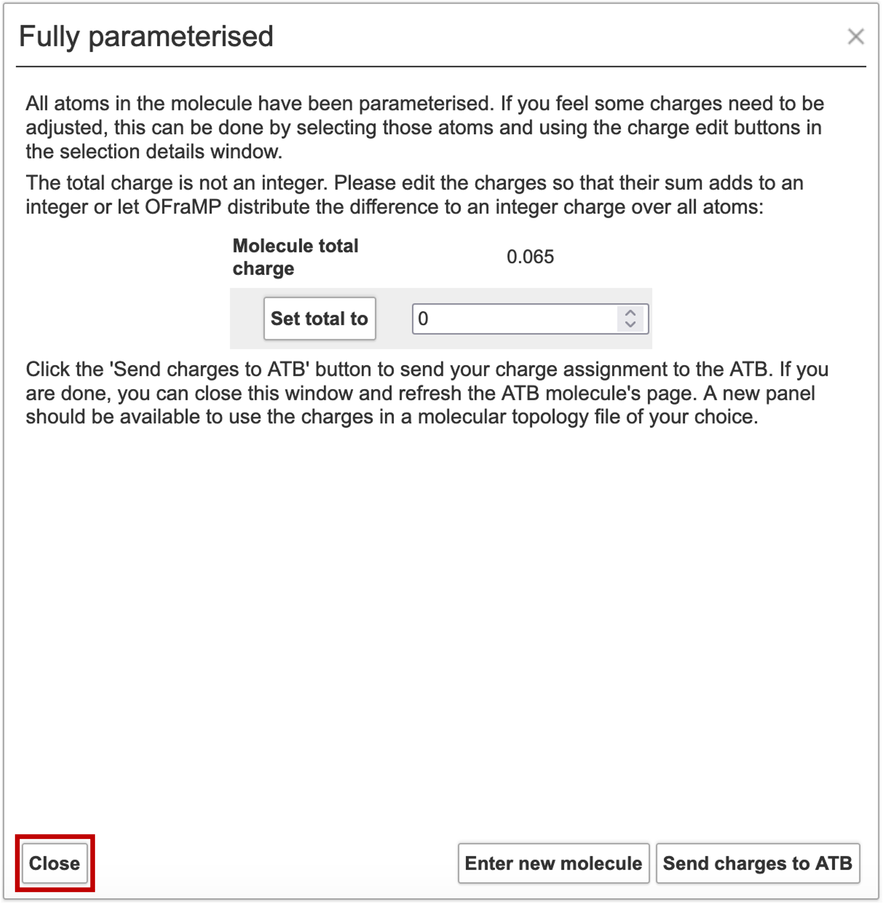

Sending Charges to the ATB
==============================

Once your target molecule is fully parametrised the window below will appear.

The total charge of your molecule may not be correct. If this is the case you can do one of two things. 

#. You can average the charge difference between the current charge of the molecule and your desired charge over all the atom groups. 
#. You can manually change the charges of specific atoms.

To average the difference of the charge evenly among all the atom groups first type the appropriate integer charge in the input box.

Then click 'Set total to'. 

The 'Molecule total charge' should now be equal to your selected integer.

If you are happy with the parametrisation of your target molecule, click 'Send charges to ATB' on the window.

To manually change the charges of specifc atoms you must first close the window,

Please view this `tutorial <https://atb-uq.github.io/atb_docs/OFraMP/Manual_charge_change.html>`_ on how to manually change the charge of individual atoms.

Once you are happy with the parametrisation of your target molecule, click 'Send charges to ATB' in OFraMP's menu. 

