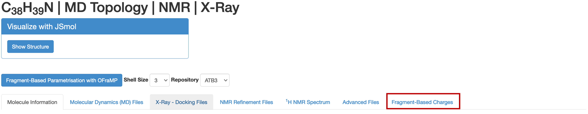
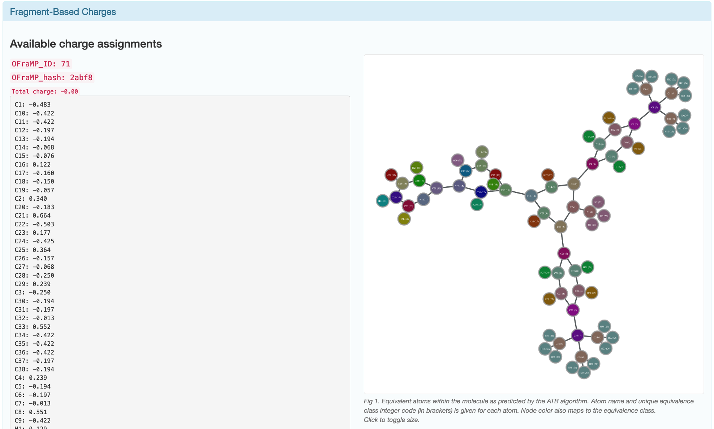
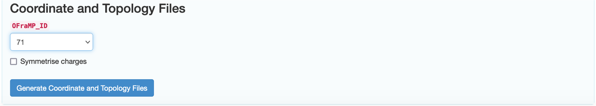
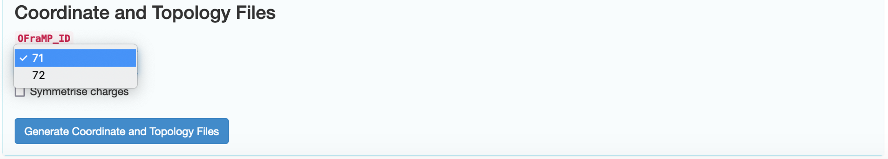
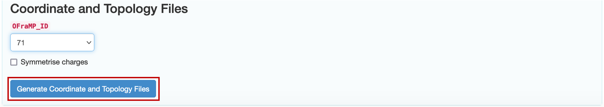
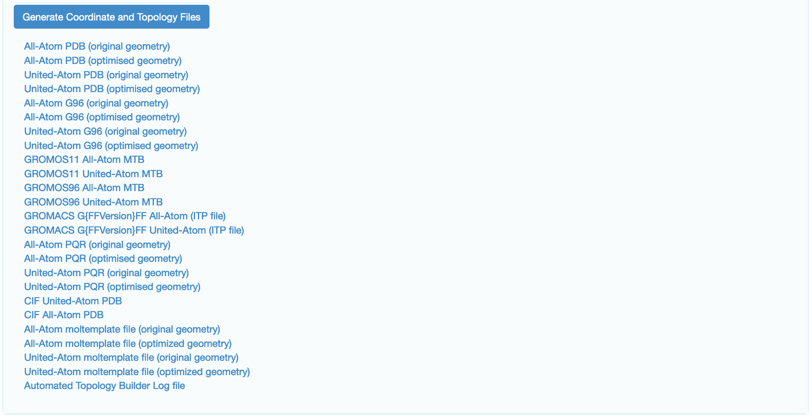

Downloading Coordinate and Topology files
===========================================

Once you have sent the charges of your fully parametrised target molecule to the ATB, you can access its coordinate and topology files on its information page on the ATB. Once you have navigated to your target molecule's information page click on the 'Fragment-Based Charges' tab.

You will then be able to see the available charge assignments for your target molecule.

Scroll down to the ‘Coordinate and Topology Files’ section of the page.

There may be more than one charge assignment for your target molecule. If this is the case, choose the one most appropriate one for your simulation. 

Click ‘Generate Coordinate and Topology Files’.

The coordinate and topology files will load below the ‘Generate Coordinate and Topology Files’ button. These can be `downloaded <https://atb-uq.github.io/atb_docs/general/downloading_files.html>`_ in the same way as other ATB files. 

