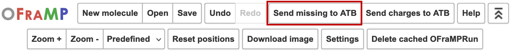

Missing Charges
===============

One or multiple atom groups may not be able to assigned a charge from the available pre-parametrised molecules from the ATB at your chosen shell size. These atom groups will be coloured in red.

.. image:: images/missing_atom_groups.png
   :width: 500

To resolve this, click 'Send missing to ATB' in OFraMP's menu. This will generate a one or more molecule's that will cover the missing paramter space, and send them to the ATB for processing. 

You can also choose to `submit <https://atb-uq.github.io/atb_docs/general/submitting_molecules.html>`_ a molecule in the ATB that covers the missing parameter space yourself. 

The missing charge parameters can also be assigned `manually <https://atb-uq.github.io/atb_docs/OFraMP/Manual_charge_change.html>`_. 

Reducing the shell size to search for the missing atom groups in a larger set of fragments is also an option. 
