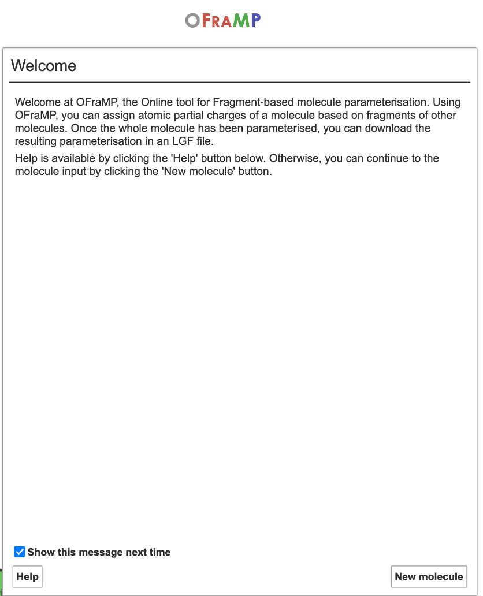
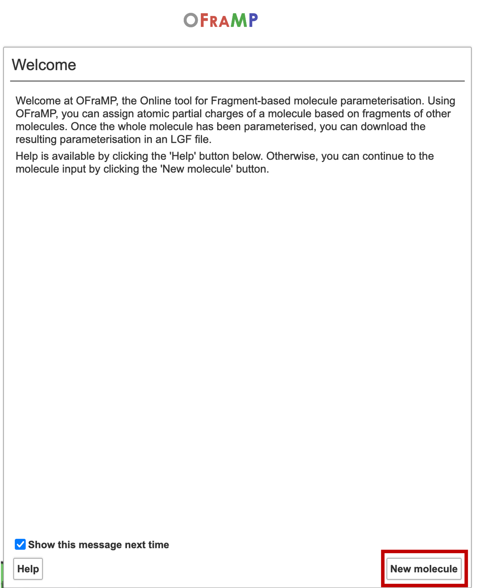
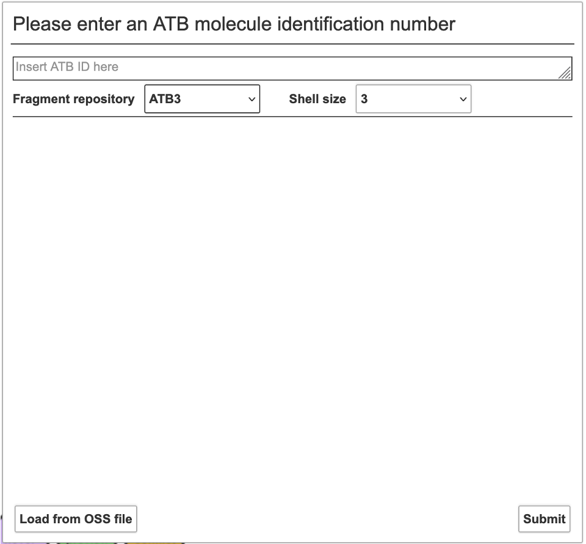
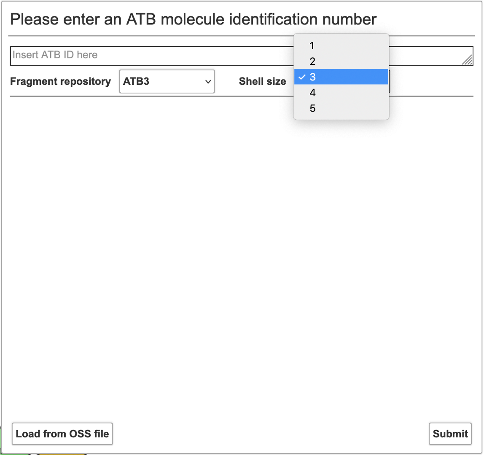
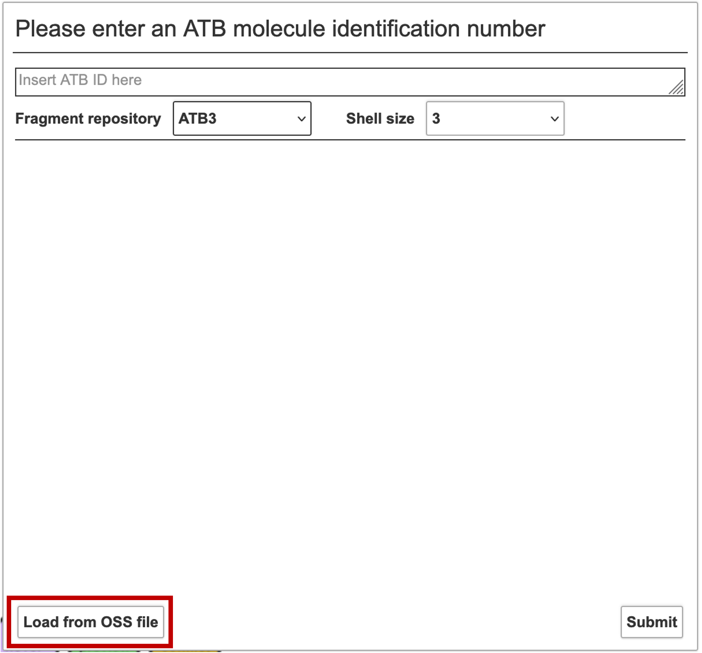
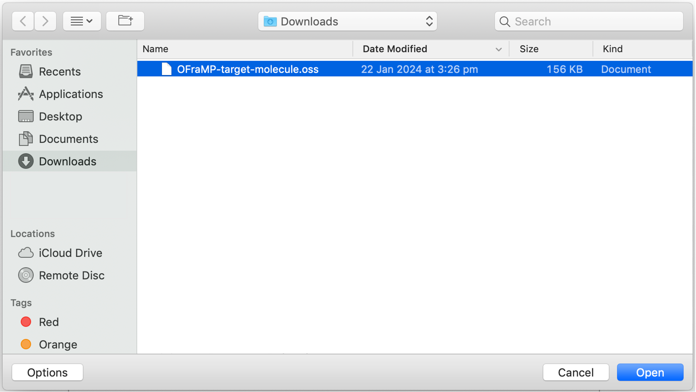
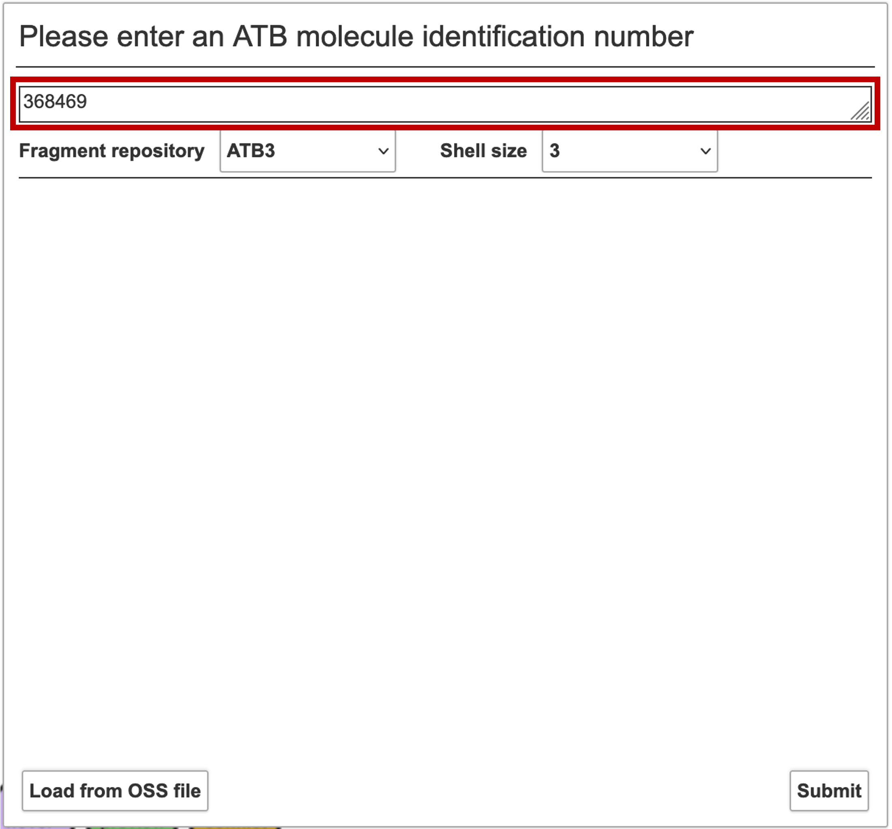
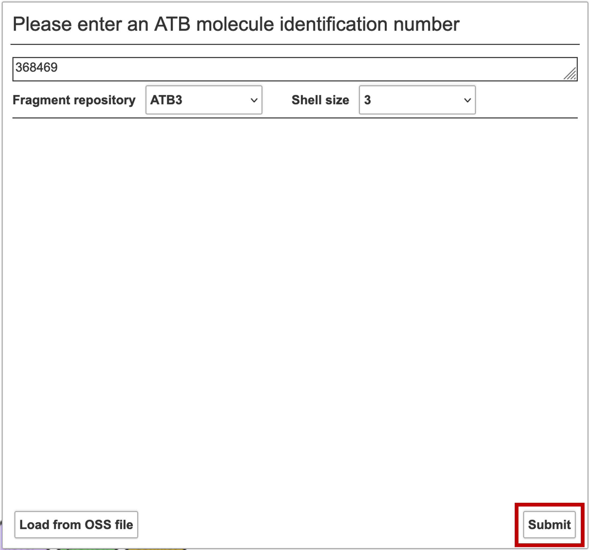

Importing a molecule into OFraMP
================================

A molecule can be imported into OFraMP in two ways. 

#. Through the OFraMP website
#. Through the molecule's information page on the ATB

OFraMP website
--------------
Access the OFraMP website through the URL https://fragments.atb.uq.edu.au/oframp/ 

A webpage with with a welcome message will be loaded. 

Click 'New Molecule'.

A new window will be loaded.

From this window you can either upload an OSS file from your device, or you can import a molecule from the ATB.

Before importing your molecule to the ATB, select the shell size.

Ignore the 'Fragment repository' select list. The only currently available option is ATB3.

To upload an OSS file from your device click on 'Load OSS file'. 

Navigate to your OSS file and click 'Open'.

To import a molecule from the ATB database, enter the molecule ID of the desired molecule into the input box. 

Click 'Submit'.

In both methods, an OFraMP page will load your target molecule. This may take a few minutes. 

.. image:: images/Loaded_target_OFraMP_molecule.png
   :width: 600

Molecule's information page
---------------------------

Navigate to the your target molecule's information page.

Access to and selection options for OFraMP is near the top of the web page.

.. image:: images/Molecule_information_page.png
   :width: 600

Select the shell size.

.. image:: images/Molecule_information_page_shell_size.png
   :width: 600

Ignore the 'Fragment repository' select list. The only currently available option is ATB3.

Click 'Fragment-Based Parametrisation with OFraMP'.

.. image:: images/Molecule_information_page_OFraMP_button.png
   :width: 600

An OFraMP page will load your target molecule. This may take a few minutes. 

.. image:: images/Loaded_target_OFraMP_molecule.png
   :width: 600

