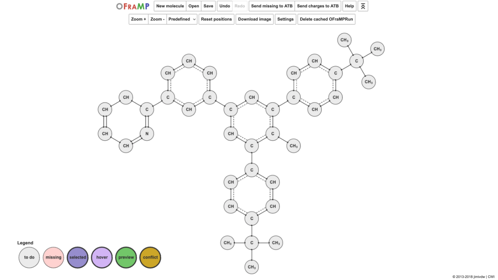

Importing a molecule into OFraMP
================================

A molecule can be imported into OFraMP through the molecule's information page on the ATB website. 

First, login into the ATB and navigate to your target molecule's information page. Access to and selection options for OFraMP are near the top of the web page.

.. image:: images/Molecule_information_page.png
   :width: 600

Select the shell size.

.. image:: images/Molecule_information_page_shell_size.png
   :width: 600

Ignore the 'Fragment repository' select list. The only currently available option is ATB3.

Click 'Fragment-Based Parametrisation with OFraMP'.

An OFraMP page will load your target molecule. This may take a few minutes. 

