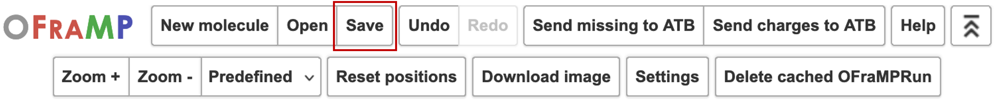
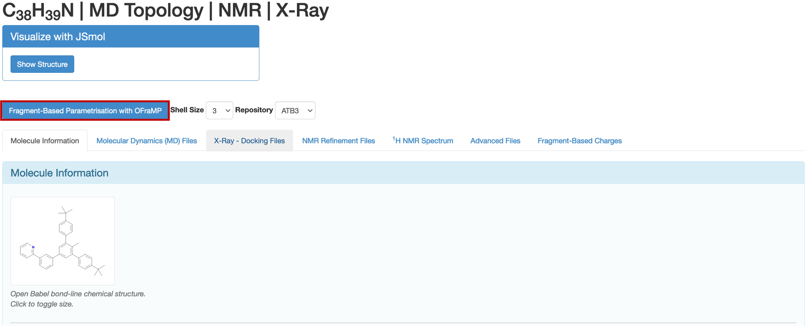
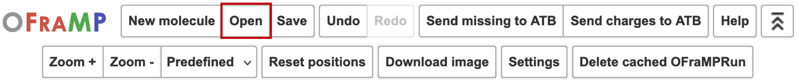
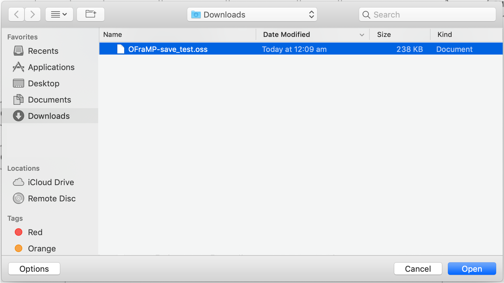

Saving Your Progress
====================

You may, for any reason, need to pause building your target molecule. In this case you may save your progress to an OSS file on your device. To do this, simply click 'Save' in the OFraMP menu at the top of the web page.

You may then rename the file and save it to the appropriate location.

Opening an OSS file
--------------------

To open the OSS file that contains your saved progress, you must first access OFraMP through your target molecule's information page on the ATB.

Once the representation of your target molecule has loaded, click 'Open' in the menu at the top of the web page.

You can then select and open your OSS file.

The charges selected for your molecule in your previous OFraMP session will be loaded into the molecule scaffold. You may then proceed selecting fragments as normal until the target molecule is complete.

