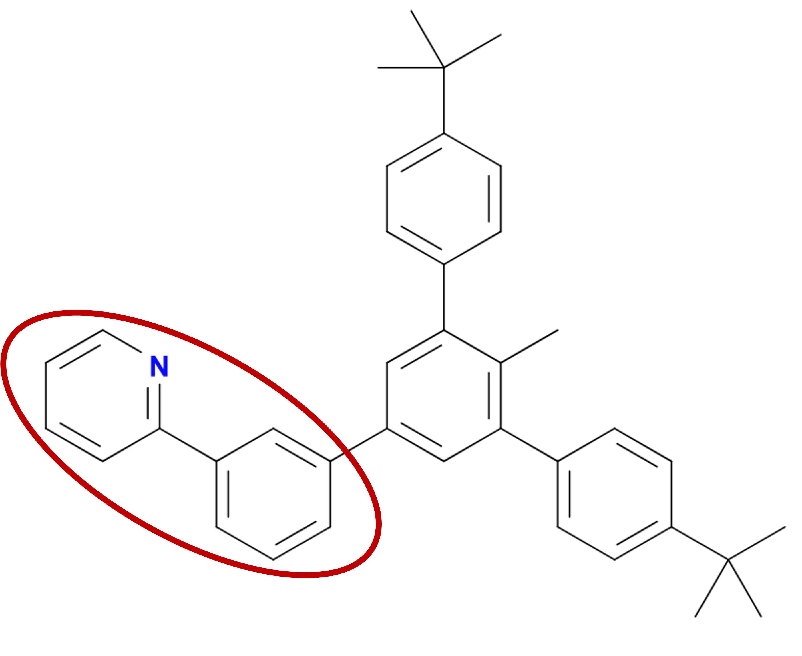
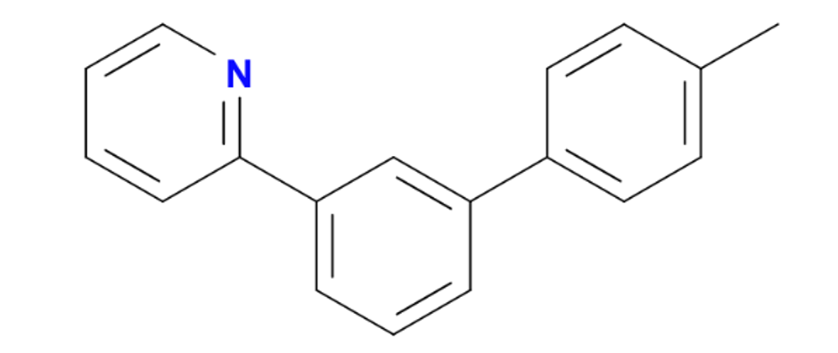
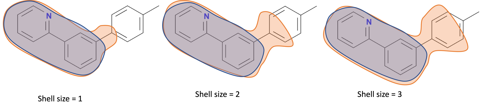

Shell size
==========

The shell size refers to the number of bonds extending from the fragment in the pre-parametrised molecule in the ATB database that must also match the atoms within the target molecule. 

An example target molecule is shown in the image below. The fragment of the target molecule that a match is being found for is circled in red.

The pre-parmaterised molecule that the fragment is being selected from is shown below.

Three different shell sizes, and therefore the group of atoms (orange) that must match a section of the target molecule for a subsection of that group of atoms (blue) to be considered a potential fragment.

As can be seen a higher shell size means that the potentials fragments selected by OFraMP are likey a better match for the target molecule; however, the number of potential fragments from the ATB repository will be reduced. This may make it more difficult to build your target molecule. 
