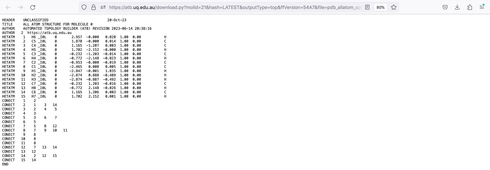

.. _Downloading Outputs:
Downloading Outputs
================================

The information page of a molecule contains
*Files necessary for running molecular dynamics simulations: MTB, G96, PDB, ITP, or moltemplate files depending on the selected format (GROMACS, GROMOS11, GROMOS96, and LAMMPS). The LAMMPS formate is experimental. 
*X-ray docking files: eLBOW CIF, CCD compatible CIF, PDB, CNS (parameter and topology), PQR, and CYANA files
* NMR refinement files: CYANA, CNS (parameter and toplogy), and PDB files. These files are only available for molecules that have been labeled as amino acids by the ATB team. 

.. note::
   All the files on the molecule page are created using tools developed by the ATB team or other groups. 
  
To retrieve these files simply click on the appropriately labeled tab on the molecule page's navigation bar.

.. image:: images/molecule_information_page_tabs.png
   :width: 600

For example, if you wish to download the PDB or ITP files for your molecule to run a simulation, you can click on the ‘Molecular Dynamics (MD) Files’ tab.  You can select the format in which the MD files will be downloaded. You can select between GROMACS, GROMOS11, GROMOS96, and LAMMPS. 

Click on the hyperlink of your desired file.

.. image:: images/file_hyperlink.png
   :width: 600

This opens a page with contents of your desired file.

Firefox and Safari
------------------

If you are using Firefox or Safari then this information cannot be dowloaded. You must instead create a text file with an appropriate name and the correct file extension. Then simply copy and paste the contents of the web page into the aforementioned open file. 

This method will work with all web browsers.

Google Chrome
-------------

If you are using Google Chrome click the kebab menu to right of the URL bar. Navigate to \"More Tools"\  and the click on \"Save Page As"\ . 

.. image:: images/kebab_menu.png
   :width: 250

Rename the file with the desired file name and the appropriate file extension. Save it to the desired file location.

.. image:: images/google_saving_window.png
   :width: 250
