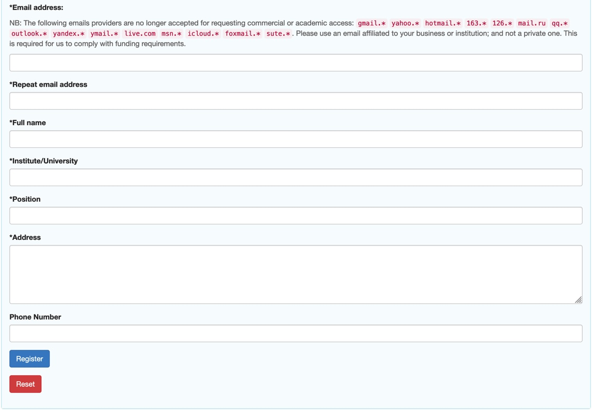
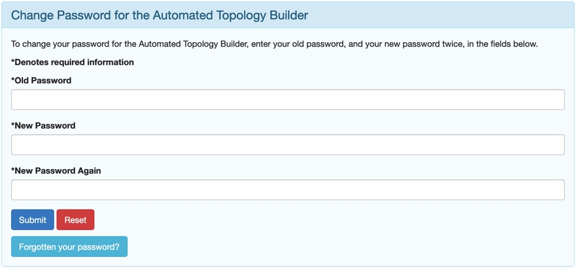

Registering for an ATB Account
==============================

It is possible to access to access many of the basic features of the site directly however in order to submit a new molecule or to download files, you need to be logged into your account. If you do not have an account, you need to create one. 

To do this, navigate to the \"Register"\  tab in the top navigation menu of the ATB website. 

.. image:: images/Registration_page_part_1.jpg
   :width: 600

Once you have stated whether you are using the ATB for Commercial or Academic use, you can then input the required information and click register.

Password
--------

Your password will be sent to the email that you used to register your account. You can change this password by clicking on your profile name in the navigation bar and then selecting \"Manage"\. Selecting \"Manage"\  will open a page that will allow you to change your password, unsubscribe from ATB emails, and update your account details. 

.. image:: images/ATB_Manage_page.jpg
   :width: 600

Clicking on the \"Change Password"\  button will open a new webpage. Once you have input your old and new passwords in the appropriate input boxes, click submit to change your password.

