Searching for Molecules
=======================

Before submitting a molecule, check if it already exists within the ATB database. This can be done by using a structure search or by using search terms to search through the database.

Structure Search
----------------

Finding a molecule in the ATB database using a structure can be done by navigating to the \"Structure Search"\  tab in the top navigation menu. 

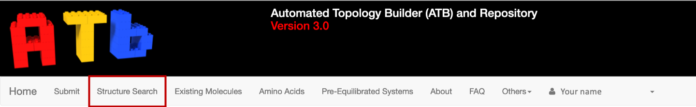

This will take you to a page where you can input the contents of your structure file.

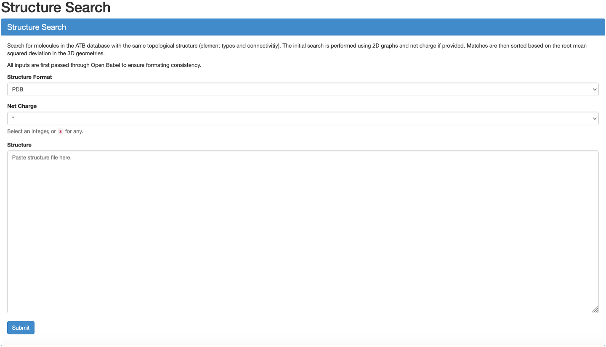

Firstly,  Select the format of the coordinate file of the molecule you are using to search for your molecule in the database. The ATB supports searches using PDB, SDF, MOL and MOL2 coordinate files. 

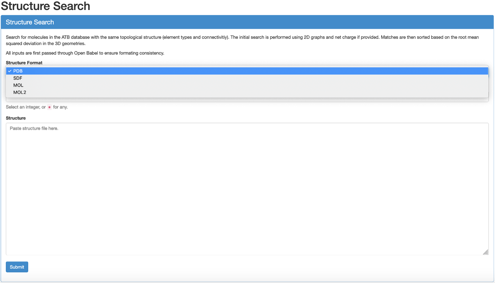

Secondly, select the charge of your molecule.

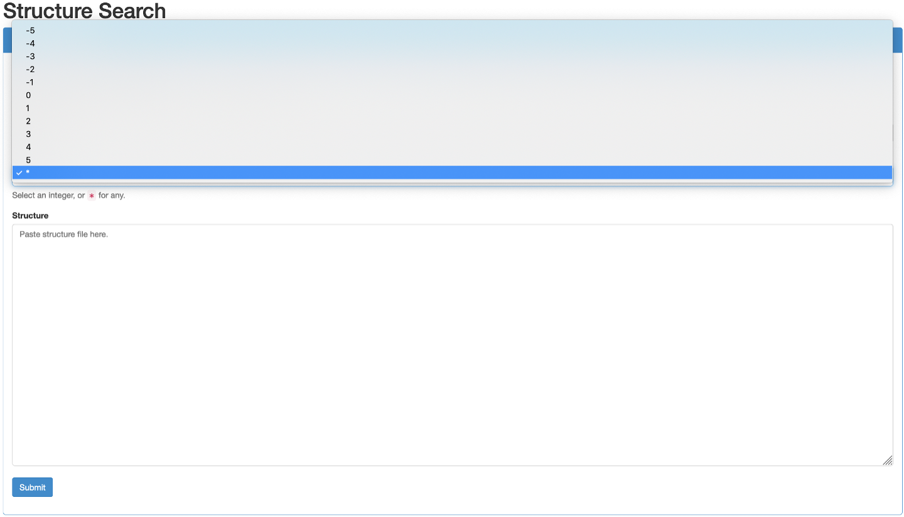

Finally, paste the contents of your file into the designated input box and press \"Submit"\. 

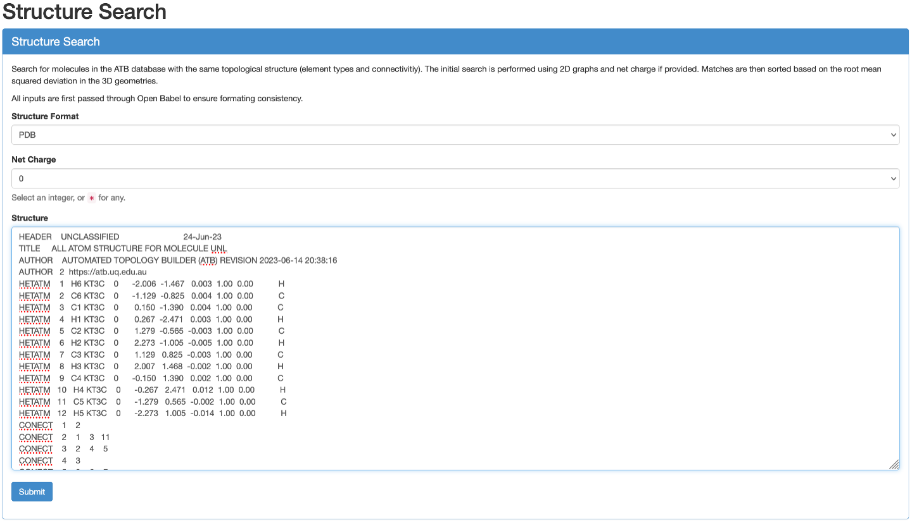

Match Found
^^^^^^^^^^^

If there are matching molecules in the database they will appear beneath the \"Submit"\ button. Click on \"Show Molecule Page"\ to open the molecule information page in a new tab. If you want to download the output files of this molecule please refer to :ref:`Downloading Outputs`. 

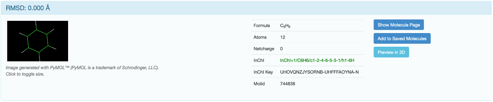

No Match Found
^^^^^^^^^^^^^^

If a matching molecule is not within the ATB database you will see a message stating \"No matching molecules were found in the ATB database."\  beneath the submit button. 

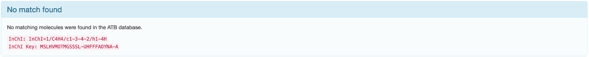

The desired conformer of your molecule may also not be available. If either of these are the case, please refer to the \"Submitting New Molecules"\  page. 

Database Search
---------------

Searching through the ATB database can also be done by navigating to the \"Existing Molecules"\  tab in the top navigation menu. 

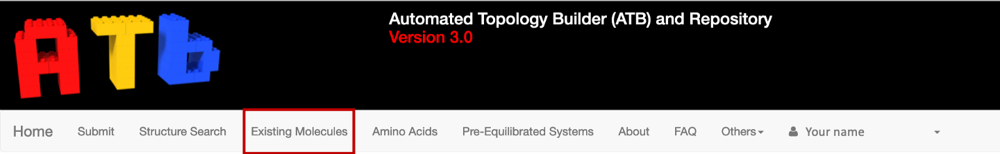

You will be sent to a page with a number of search bars and a list of the 100 most recently processed molecules. 

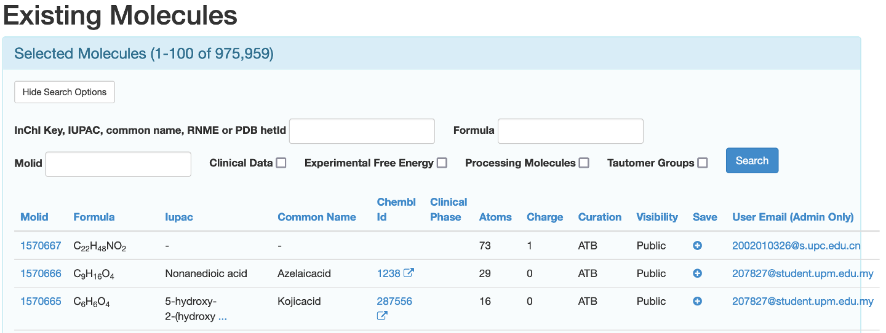

You can search for the molecule in three ways.

* By entering a InChI key, IUPAC, common name, RNME or PDB hetID in the designated input box
* By entering the chemical formula of the desired molecule in the designated input box
* If known, by putting the molID of the desired molecule in the designated input box. 

This search can be further refined to only include molecules that have clinical data available, molecules that have the experimental free energy available, molecules that are currently being processed, molecules that have had their tautomers enumerated, or a combination thereof by checking the appropriate boxes. 

Once you click the \"Search"\  button, the list of molecules beneath the search bars will be reloaded to match your search terms. To access the access the information page of your desired molecule, click its molid. 

If you did not search for the molecule using molID you may be presented with multiple options that look appropriate for your work. For example, searching the ATB database using the search term ibuprofen yields multiple conformers of both possible enantiomers for the molecule.

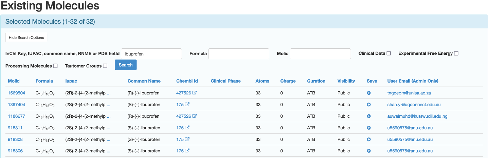

To know how to compare these molecules please refer to the \"Comparing Molecules"\  section of this page. 

If you cannot find the molecule you are looking for, you can submit the molecule for processing. For information on how to do this, please refer to the \"Submitting New Molecules"\  page.

Comparing Molecules
-------------------

There may be multiple conformers of your desired molecule in the ATB database, you will be able to see them on the molecule's information page. They will appear in the \"Other conformers for this molecule"\ section beneath \"Processing Information"\.  These molecules can be compared so the version that is best suited to your work can be selected. Each conformer will have a \"Compare with"\  button that you can click on.

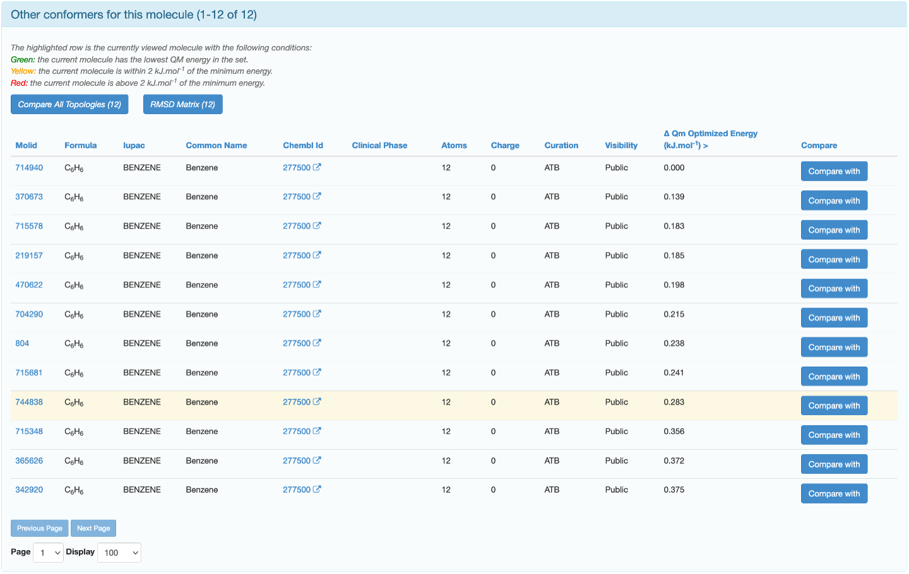

The highlighted row is the conformer you are currently on the page of. Clicking on \"Compare with"\  will take you to a page which displays the GROMOS topology as well as a RMSD Superposition of the reference molecule (green) and the molecule it is being compared with (blue). 

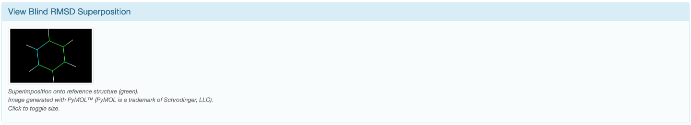

You can use these to determine which conformer is most suitable for your work. If none of the conformers will meaningfully affect the outcome of your work, choosing the one with the lowest QM energy is a common strategy.

