Submitting New Molecules
========================

If the desired molecule has not yet been entered into the database, then it can be submitted for processing. 

Submission Process
------------------

Submitting a new molecule can be done by navigating to the \"Submit"\  tab at the top of the navigation menu.

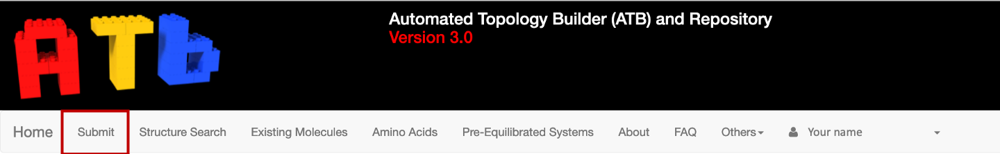

This will open a page where you can submit a molecule to the ATB using 4 different methods.

* Drawing/Modifying a molecule with JSME and JSmol. 
* Providing a SMILES string. 
* Uploading a PDB coordinate file
* Pasting the contents of the PDB file into the designated input box.

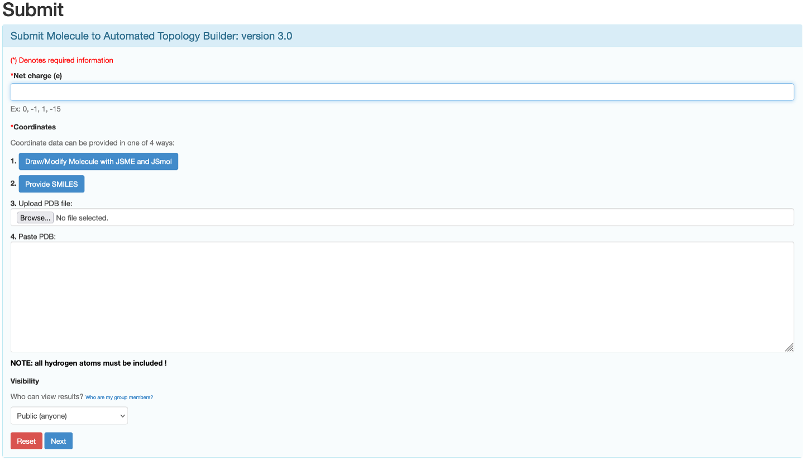

Before you enter the coordinate data you must supply the net charge of the molecule.

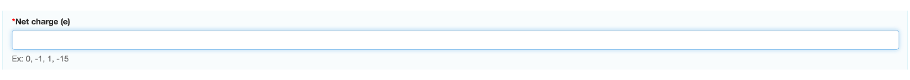

If you are entering your coordinate data using JSME and JSmol please see :ref:`Using JSME and JSmol`.

If you are entering your coordinate data by providing a SMILES string, please see :ref:`Using SMILES`.

If you are uploading a PDB file, click browse, and choose the file from your device.

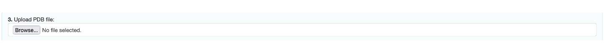

You can also simply copy and paste the contents of the PDB into \"Paste PDB"\  input box. 

.. note::
   ALL the HYDROGEN atoms must be included when providing coordinate data.

Once you have input the charge of your molecule and the coordinate data, click the next button. A new page containing a preview of the molecule that you wish to submit will be loaded. If the coordinate data matches that of a molecule within the database you will be informed by a red message that states ‘Your submission was within 0.1 Å RMSD of an existing structure within our database (molecule with same InChI key and net charge)’.

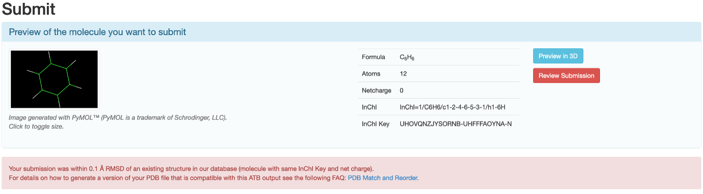

The molecules within the ATB database that match your submission will appear beneath this message. You may view the information page of the matching molecule by clicking \"Show Molecule Page"\.

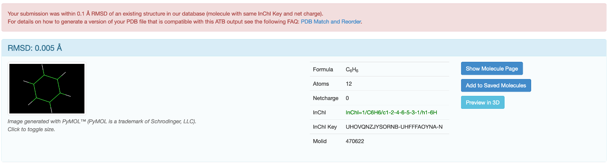

If you would like to submit your version of the molecule, refer to the FAQ.

If the molecule is not within the ATB database a button that allows you to submit the molecule for processing will appear.  

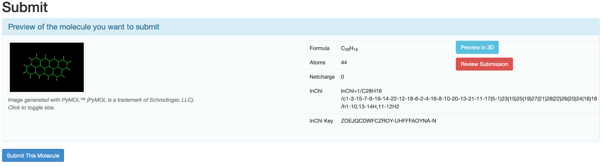

Once, you click \"Submit this Molecule"\  you will be sent periodic emails informing you of the progress of your submission. Once the topology of the molecule has finished being calculated, you will be able to view your submitted molecule by clicking on your profile name in the navigation menu and then selecting submitted molecules. 

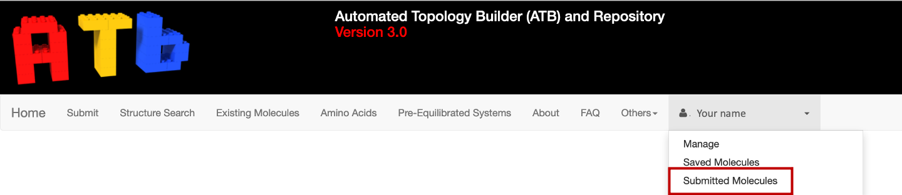

If you click on the Molid of you molecule you will be able to view its information. 

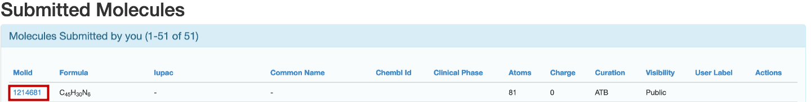

.. _Using JSME and JSmol:
Using JSME and JSmol
--------------------

If you decide to use JSME and JSmol to submit the molecule, click the \"Draw/Modify with JSME and JSmol"\  button. A new window that contains JSME, JSmol and a SMILES input box will open.

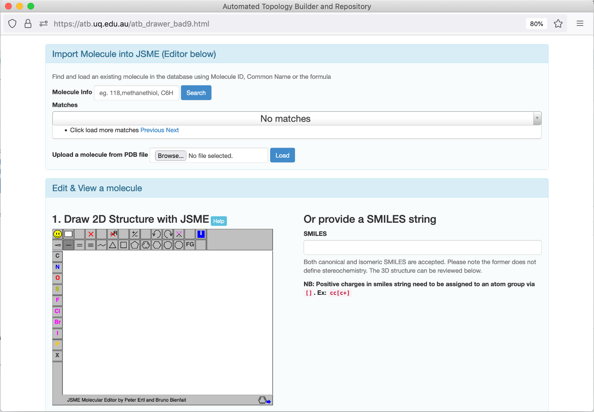

You can use the JSME to draw molecule a from scratch

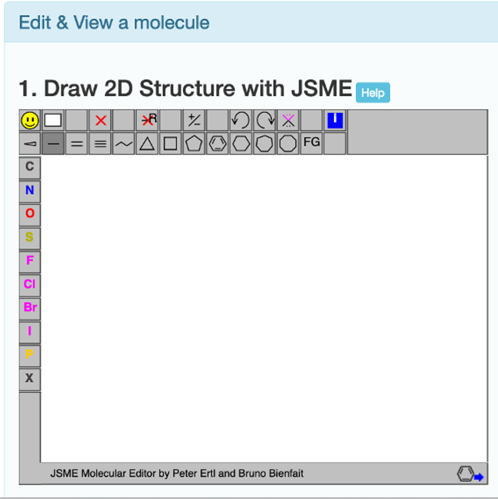

or you can import a molecule into the JSME molecular editor and modify it. 

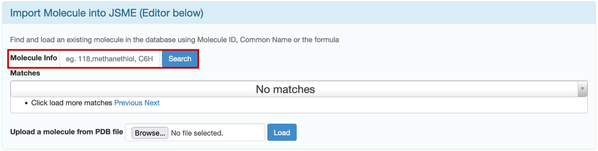

The first way to do this is to import a molecule from the ATB database. This can be doen by inputting either the chemical formula of the molecule, the name of the molecule, or the ID of the molecule in the ATB database into the \"Molecule Info"\  input box and clicking search. The matches found in the ATB database will be loaded below the ‘Molecule Info’ input box. 

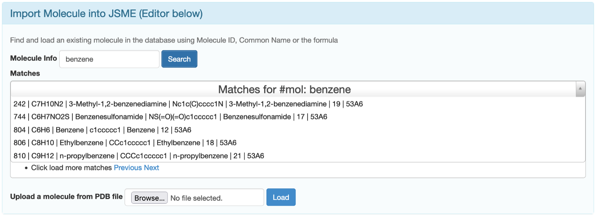

You can load a line structure of your desired molecule into JSME by simply clicking on correct match. 

The second way is to  upload a PDB coordinate file from your computer and then click \"Load"\.

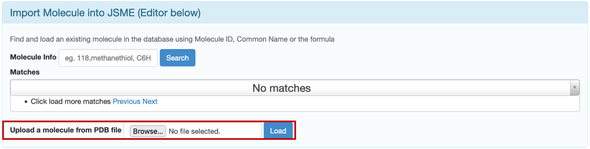

A line structure of your molecule will be loaded into JSME.

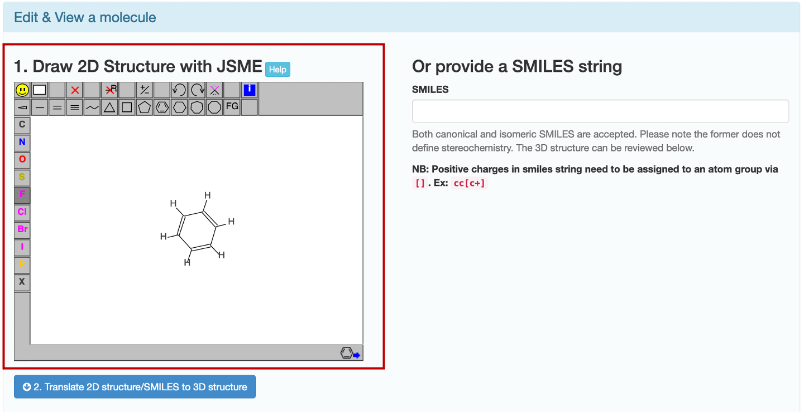

Once the desired line structure has been drawn, click \"Translate 2D structure/SMILES to 3D structure"\ . You will be able to view your molecule in 3D using JSmol.

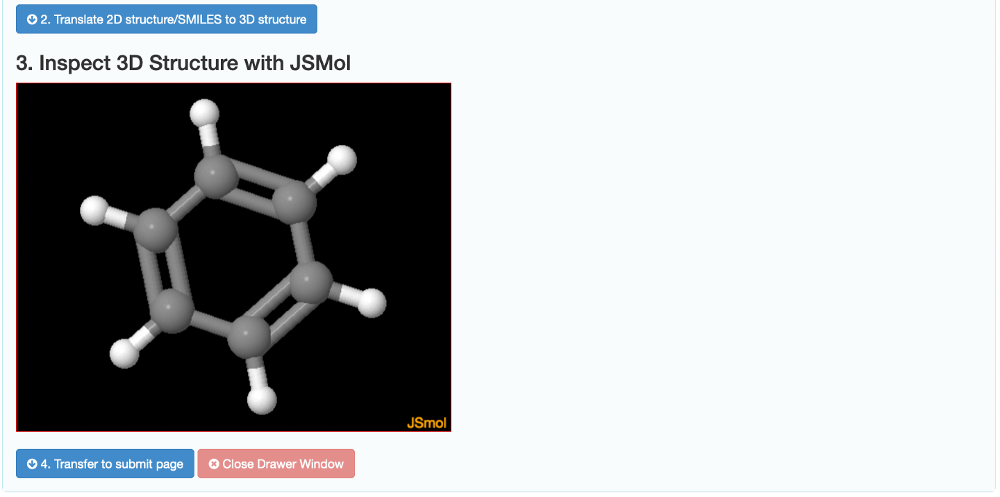

If you are happy with your molecule, click \"Transfer to submit page"\ . You will be returned to the molecule submission page with the PDB coordinates pasted in the designated input box. 

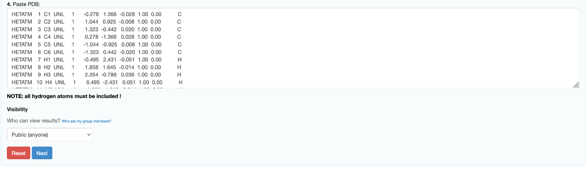
.. _Using SMILES:
Using SMILES
------------

If you decide to use SMILES to submit the molecule, click the \"Provide SMILES"\  button. A new window that contains JSME, JSmol and a SMILES input box will open.

The input box where you type the SMILES string is to the right side of the JSME molecular editor. 

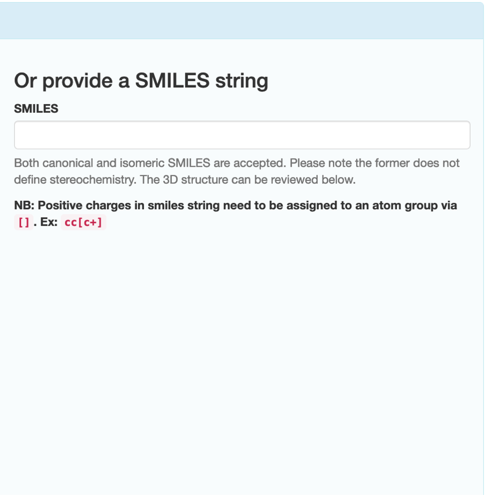

Type the SMILES string of your molecule into the input box.

.. note::
   Positive charges in the SMILES string must be assigned to an atom group via []. e.g., cc[c+]

Click \"Translate 2D structure/SMILES to 3D structure"\ . You will able to view your molecule in 3D using JSmol. 

If you are happy with your molecule, click \"Transfer to submit page"\ . You will be returned to the molecule submission page with the PDB coordinates pasted in the designated input box.

